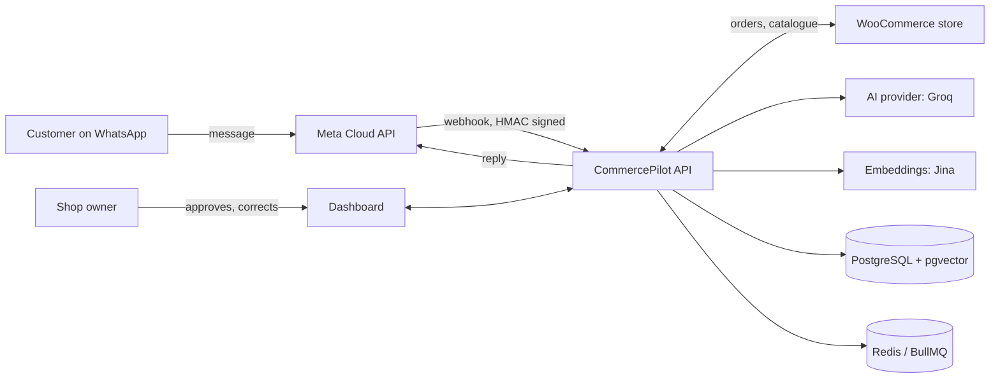
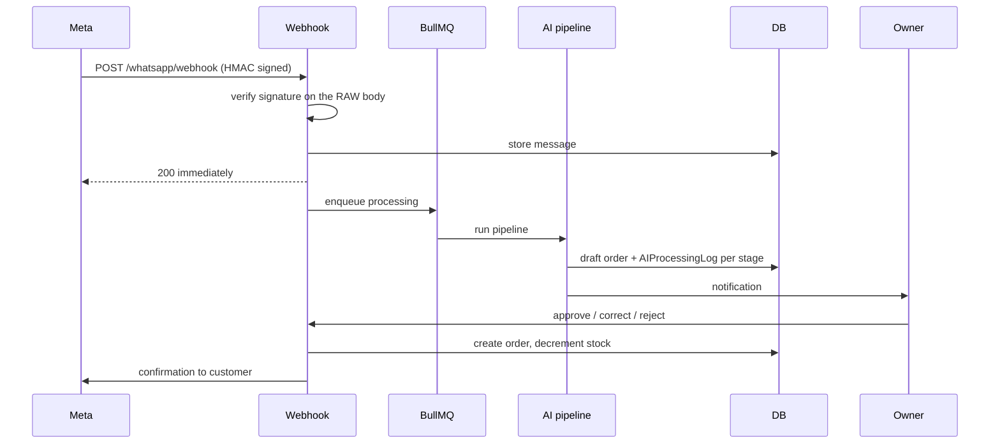
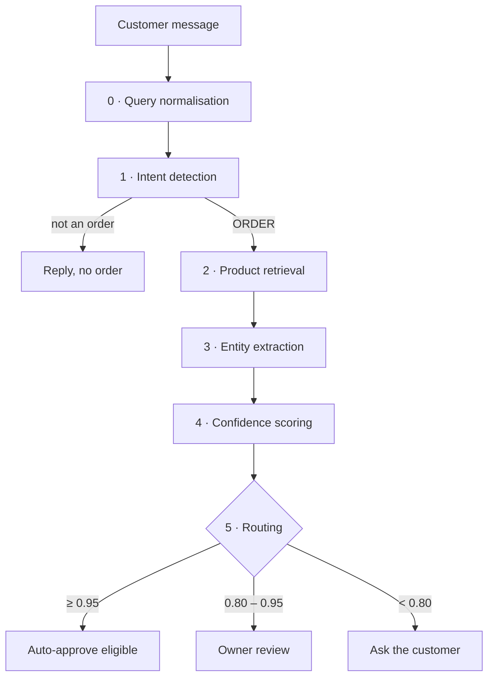
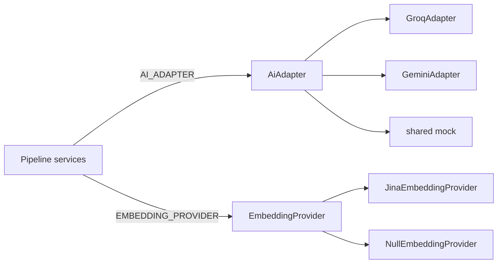
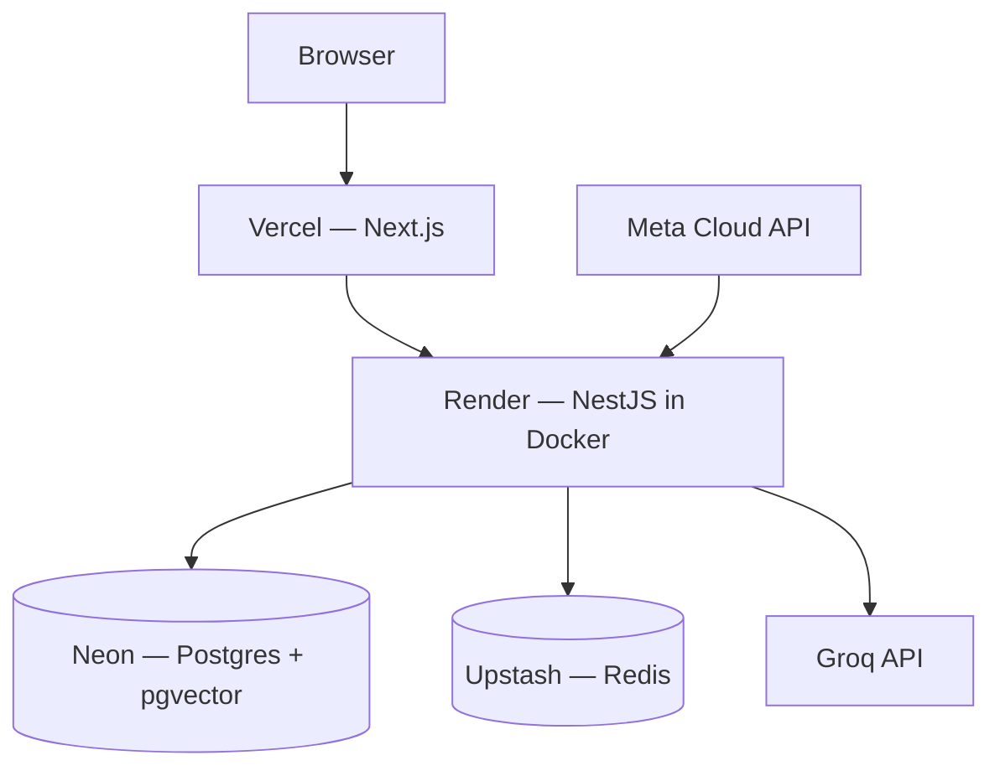

# Architecture

How CommercePilot is put together, and why. This describes the system as it
actually is — where something is planned but not built, it says so.

- [System context](#system-context)
- [Architectural style](#architectural-style)
- [Request lifecycle](#request-lifecycle)
- [The AI pipeline](#the-ai-pipeline)
- [Provider abstraction](#provider-abstraction)
- [Multi-tenancy](#multi-tenancy)
- [Data model](#data-model)
- [Stock and variants](#stock-and-variants)
- [Domain events](#domain-events)
- [Failure behaviour](#failure-behaviour)
- [Configuration and feature flags](#configuration-and-feature-flags)
- [Deployment topology](#deployment-topology)
- [Known limits](#known-limits)

---

## System context



CommercePilot sits **between** WhatsApp and a store the business already runs.
It is not a storefront and not a chatbot. Its job is to turn free-form chat
into a structured, reviewable order.

---

## Architectural style

**Modular monolith on Clean Architecture.** Chosen deliberately over
microservices: the operational cost of a distributed system buys nothing at
this scale, while module boundaries kept clean leave the option open later.

```
Presentation      Controllers, DTOs, guards
      ↓
Application       Services — all business logic lives here
      ↓
Domain            Models, state machines, business rules
      ↓
Infrastructure    Prisma repositories, external adapters
```

Dependencies point inward only. Infrastructure never contains business rules.

### Non-negotiable rules

These are enforced across the codebase and in review:

| Rule | Why |
|---|---|
| Every table carries `tenantId`; every query filters by it | One missed filter is a cross-tenant data leak. Two reached production before this rule was enforced. |
| External dependencies sit behind an interface | The AI provider was swapped from Gemini to Groq without touching a single pipeline service. |
| No module reads another module's tables | Cross-module communication is service calls and domain events. |
| Nothing is hard-deleted from business tables | `deletedAt` only — order history must stay resolvable. |
| UUIDv4 primary keys, generated in the application | Not database-generated; ids exist before the write. |
| The audit log is append-only | Never updated, never deleted. |

### Backend modules

| Module | Responsibility |
|---|---|
| `auth` | Registration, JWT issue/refresh/revoke, RBAC |
| `whatsapp` | Webhook ingestion, HMAC verification, dev simulator |
| `ai-engine` | The extraction pipeline, metrics, duplicate detection, demand logging |
| `orders` | Draft lifecycle, approval workflow, stock validation, SSE events |
| `products` | Catalogue and per-variant stock |
| `customers` | Auto-created from WhatsApp number; order and message history |
| `conversations` | Multi-turn state, human handoff |
| `integrations` | WooCommerce product and order sync |
| `notifications` | Owner and customer notifications |
| `audit-logs` | Immutable trail of state-changing actions |
| `users` | Team management with privilege-escalation guards |
| `admin` | Cross-tenant operations for `SUPER_ADMIN` |
| `tenant-settings` | Per-tenant config, encrypted credentials |
| `health` | Liveness and readiness probes |

---

## Request lifecycle

A customer message, end to end:



Two decisions worth noting:

**The webhook returns 200 before processing.** Meta retries anything slow or
failed, so acknowledging first and queueing the work prevents duplicate
deliveries. The queue also absorbs bursts.

**HMAC verification happens on the raw body**, before any parsing. Verifying a
re-serialised object would compare a different byte sequence and fail
intermittently.

---

## The AI pipeline

Six stages. Every one writes an `AIProcessingLog` row with the model used,
timing, and success — so any decision can be explained afterwards rather than
trusted blindly.



### 0 · Query normalisation

Non-Latin messages are translated to a short English search phrase **for
retrieval only**.

This exists because product search tokenises on `[^a-z0-9]`, which strips every
Sinhala character — a Sinhala message produced **zero** search terms and matched
nothing. Embedding the raw script did not help either: measured against real
catalogue text, Sinhala queries ranked the same unrelated product first every
time, with margins of 0.005–0.035. That is noise, not ranking.

Normalising first fixed both paths: vector margin 0.010 → 0.421, text terms
0 → 2.

**Extraction still receives the original message.** Normalisation deliberately
discards quantity, size and politeness; a draft built from the normalised text
would silently lose the "2" the customer asked for. A mutation-tested invariant
guards this split.

Latin-script messages skip the stage entirely — Singlish already retrieves well
(0.628, margin 0.322), so rewriting it would spend quota and risk a downgrade.

### 1 · Intent detection

Classifies the message. Anything that is not an order exits the pipeline here.

### 2 · Product retrieval (RAG)

Vector search over `products.embedding` (pgvector, 768 dimensions, HNSW index,
cosine distance) with a `RAG_MIN_SIMILARITY` floor. Falls back to term-based
text search when no embedding is available.

The retrieved catalogue slice is the **only** product data the extractor sees.
The model is therefore architecturally unable to invent a product that does not
exist for that tenant.

If a customer arrived from a Click-to-WhatsApp ad, the ad's copy is appended to
the search text — someone who taps an ad often writes only "mata meka one"
("I want this"), which is unmatchable alone but trivial once the ad headline is
in scope.

### 3 · Entity extraction

Produces structured JSON: items, quantities, attributes, delivery details, and
which catalogue product each line matched.

### 4 · Confidence scoring

A composite, not the model's self-assessment:

```
intent × 0.25  +  product match × 0.40  +  completeness × 0.25  +  history × 0.10
```

The heaviest weight sits on **retrieval similarity** — a signal the model cannot
inflate. This matters: in testing, the model returned 0.9 self-confidence on
answers that were factually wrong.

### 5 · Routing

| Score | Outcome |
|---|---|
| **≥ 0.95** | Eligible for auto-approval — *only if the tenant enabled it; off by default* |
| **0.80 – 0.95** | Draft created, owner reviews |
| **< 0.80** | No draft; the assistant asks the customer to clarify |

The floors are constants in `ConfidenceScorerService`, not tenant-editable. A
tenant may set a *stricter* threshold, never a looser one.

### Alongside the pipeline

| Service | Purpose |
|---|---|
| `DuplicateDetectorService` | Same customer, product and quantity within N minutes → flags `POTENTIAL_DUPLICATE` for review. Flags, never auto-blocks — sometimes two really are wanted. |
| `UnfulfilledDemandService` | Records every request the catalogue could not match, ranked by *distinct customers*. Five people asking once is a stronger stocking signal than one asking five times. |
| `SoftAlternativesService` | Offers up to 3 close **in-stock** alternatives instead of a dead end. Never suggests a sold-out item — that is the same false promise the approval gate exists to prevent. |
| `HumanHandoffService` | After N failed clarifications, stops guessing, tells the customer a person will reply, and notifies the owner. Idempotent: the owner is alerted once however long the customer keeps typing. |

---

## Provider abstraction

Two separate interfaces, because text generation and embeddings now come from
different vendors.



**`AiAdapter`** — `generateText`, `parseJsonResponse`. Selected at startup by
`AI_PROVIDER`. Never throws into the pipeline: a provider failure returns
`success: false` so one bad call degrades a stage rather than losing a
customer's order.

**`EmbeddingProvider`** — `generateEmbedding`, `generateEmbeddings`,
`dimensions`. Selected by `EMBEDDING_PROVIDER`.

The split happened because Groq has **no embedding models at all**, so it was
carrying a method that could only ever return `null`.

### Why this abstraction earned itself

Gemini's free tier is region-gated. A key created in Sri Lanka lists all 50
models and then fails the first real call with
`limit: 0, metric: generate_content_free_tier_requests`. The allocation is zero,
not exhausted, and lifting it needs a payment card.

Swapping the entire platform to Groq touched **no pipeline service** — only the
factory in `AiEngineModule`.

### The null-vector rule

`generateEmbedding` returns `null` when no embedding is available. It never
returns a random or zero vector.

This is not stylistic. An earlier version returned `Math.random() - 0.5` on
failure, writing 768 dimensions of noise into `products.embedding` permanently.
pgvector ranked against it without complaint, so the only symptom was silently
wrong search results, and nothing ever recomputed the row.

`null` means "fall back to text search" — correct, and visible.

---

## Multi-tenancy

**Shared database, shared schema, `tenantId` on every business row.**
The column appears **62 times** across the schema.

Every query filters by the tenant on the authenticated JWT. Route parameters
and request bodies are never trusted for tenant identity.

### Verified, not assumed

Two tenants were registered and one attacked the other:

| Attempt | Result |
|---|---|
| Read another tenant's product | **404** |
| Write a variant to their product | **404** |
| Delete their product | **404** |
| List their variants | **0 items** |

404 rather than 403 is deliberate — the attacker is not told the resource
exists.

---

## Data model

**17 tables, 67 indexes, 7 migrations.** Full ER diagram in
[`Documents/SCHEMA.md`](Documents/SCHEMA.md); paste
[`Documents/schema.dbml`](Documents/schema.dbml) into dbdiagram.io for an
interactive view.

Core entities: `Tenant` → `User`, `Customer`, `Product` → `ProductVariant`,
`Order` → `OrderItem`, `WhatsAppMessage`, `Conversation`, `AIDraftOrder` →
`AIDraftOrderItem`, `AIProcessingLog`, `InventoryTransaction`, `Notification`,
`UnfulfilledDemand`, `AuditLog`.

One self-relation: `ai_draft_orders.duplicateOfId → ai_draft_orders.id`, linking
a flagged duplicate back to the original.

### The one accepted schema drift

`products_embedding_hnsw_idx` cannot be expressed in `schema.prisma` — Prisma
has no HNSW syntax. It will always appear as drift, and `prisma migrate dev`
will offer to drop it. **Never accept that**: without the index every vector
search becomes a sequential scan, silently.

Every *other* index is explicitly declared, so this is the only drift the tool
should ever report. Anything more means something is genuinely wrong.

---

## Stock and variants

`Product.stockQuantity` is a single integer. It can say "this shirt has 12
units" but never "blue in L has 3" — and telling a customer a size is available
when it is not is worse than saying nothing.

`ProductVariant` holds stock per combination, identified by a canonical
`attributeKey`:

```
{ size: "L", color: "blue" }  →  "color=blue|size=l"
```

Sorted, lowercased, stored. WooCommerce, the dashboard and the AI extractor all
describe the same variant differently; comparing raw JSON would split one
product's stock across duplicate rows. Storing the key lets the **database**
enforce uniqueness via `@@unique([productId, attributeKey])` rather than
trusting every write path to remember.

### Rollout: expand → migrate → contract

| Step | State |
|---|---|
| **PR1 Expand** | Table and nullable columns added. Nothing reads them. ✅ merged |
| **PR2 Backfill + dual-write** | Every product gets a `default` variant carrying its stock; all five stock write paths mirror. ✅ merged |
| **PR3 Switch reads** | Order validation, AI conflict checks and RAG context read the mirror, behind `VARIANT_STOCK_ENABLED`. ✅ merged, **flag off** |
| **PR4 Contract** | `Product.stockQuantity` becomes a maintained rollup. ⬜ not started |

`resolveStock` falls back to the product's own stock on **any** doubt — flag
off, no variant row, or a failed lookup. Falling back reproduces known-good
behaviour; returning 0 on doubt would silently refuse orders the shop can
actually fulfil.

A genuine zero still reports zero. That is the entire point.

---

## Domain events

Modules communicate through `EventEmitter2`, never by reaching into each
other's tables.

| Event | Emitted when | Consumed for |
|---|---|---|
| `draft.created` | The pipeline produces a draft | Owner notification |
| `draft.auto_approve` | Draft clears the auto-approve floor | Approval flow |
| `order.approved` | Owner approves | WooCommerce sync, stock decrement, customer confirmation |
| `order.rejected` | Owner rejects | Customer notification |
| `conversation.handoff_requested` | Clarification limit reached | Owner alert |

---

## Failure behaviour

Non-functional testing verified each of these by stopping the dependency
mid-flight.

| Condition | Behaviour |
|---|---|
| **AI provider down or rate limited** | Stage returns `success: false`; the order falls back to manual review. Nothing is lost. |
| **No embedding provider** | Retrieval degrades to text search. |
| **No AI key at all** | Shared stage-aware mock responds, so the pipeline runs for contributors without credentials. |
| **Redis stopped** | Registration and DB writes still succeed — Redis is not on the request path. |
| **Postgres stopped** | Liveness stays **200** (the process is alive, so no restart loop); readiness returns **503** so the platform stops routing traffic. Recovers unaided. |
| **Unexpected exception** | Generic message to the client; the real error and stack are logged server-side. |
| **Variant mirror write fails** | Logged and swallowed. A stale mirror is repaired by re-running the backfill; a lost customer order is not repaired at all. |

The liveness/readiness split matters: liveness staying up prevents a pointless
restart loop, while readiness going 503 removes the instance from rotation.

### Rate-limit exemptions

Health probes and the WhatsApp webhook are exempt from throttling, declared as
`@SkipThrottle({ short: true, long: true })`.

The named form is required. In `@nestjs/throttler` 6.x the bare `@SkipThrottle()`
defaults to `{ default: true }` and skips a throttler *named* `default` — and
this application's throttlers are named `short` and `long`. The bare form
therefore skipped nothing, and 50 of 60 concurrent health checks returned 429
until it was corrected. Four E2E tests now burst each exempt route to keep it
that way.

---

## Configuration and feature flags

Every behavioural change ships behind a flag, so it can be reverted without a
deploy.

| Flag | Default | Effect |
|---|---|---|
| `AI_PROVIDER` | `groq` | `groq` or `gemini` |
| `EMBEDDING_PROVIDER` | `none` | `jina` or `none` |
| `VARIANT_STOCK_ENABLED` | `false` | Read stock from the variant mirror |
| `QUERY_NORMALIZATION_ENABLED` | `true` | Translate non-Latin queries before retrieval |
| `SOFT_ALTERNATIVES_ENABLED` | `true` | Offer close in-stock alternatives |
| `DUPLICATE_DETECTION_ENABLED` | `true` | Flag likely duplicate drafts |
| `HANDOFF_ENABLED` | `true` | Escalate to a human after repeated failures |
| `RAG_MIN_SIMILARITY` | `0.5` | Vector search floor |
| `AUTH_RATE_LIMIT` | `5` | Registrations per minute per IP |

`VARIANT_STOCK_ENABLED` defaults **off** deliberately: enabling it before
running the backfill would make every product report zero stock.

---

## Deployment topology



The container runs `prisma migrate deploy` on boot with bounded retry before
starting the process, so a cold database or brief network fault does not fail
the deploy.

CI runs backend tests, frontend build, and the full E2E suite — with **no AI
key**, so the suite stays deterministic, costs no quota, and fails if the mock
breaks. Deploys are gated on it.

---

## Known limits

Recorded here because architecture documents that omit them are not useful.

| Limit | Impact |
|---|---|
| **AI free tier: ~30 messages/day platform-wide** | The binding constraint. ~3,250 tokens per message against a 100,000/day cap, shared by all tenants. Fix is engineering, not billing: send the top 3 products instead of the full catalogue context, and merge intent into the extraction call. |
| **Embeddings inactive** | Jina key has no balance; search is text-only. Correct degradation, not a fault. |
| **Voice notes dropped** | `processMessage` skips non-`TEXT` messages. Whisper is available on the existing Groq key but unimplemented. |
| **WooCommerce fetches page 1 only** | A shop with more than one page has a silently incomplete catalogue. Latent — every tenant is on `MOCK`. |
| **Shopify has no adapter** | Present in the settings enum, no implementation behind it. |
| **No billing** | `TenantPlan` is stored and never checked. Architecturally SaaS; commercially not yet. |

---

Related: [`README.md`](README.md) · [`TECHNOLOGY.md`](TECHNOLOGY.md) ·
[`Documents/SCHEMA.md`](Documents/SCHEMA.md) ·
[`Documents/QA_REPORT.md`](Documents/QA_REPORT.md)
