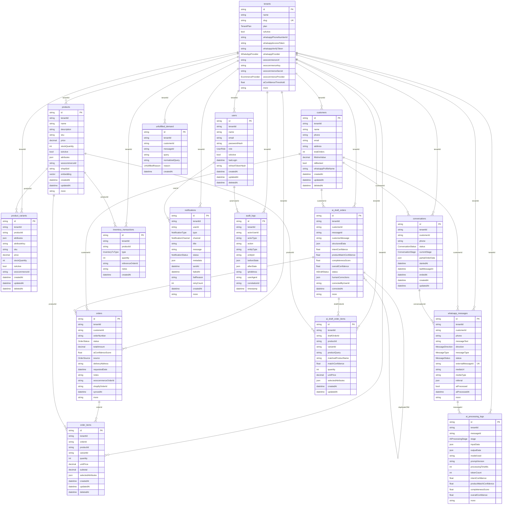

# CommercePilot — Database Schema

Multi-tenant SaaS. **Every business-owned table carries `tenantId`** — that is the
isolation boundary, and the reason almost every relationship below fans out from
`Tenant`.

Generated from `backend/prisma/schema.prisma`. For an interactive diagram, paste
[`schema.dbml`](schema.dbml) into [dbdiagram.io](https://dbdiagram.io).

## Cardinality

All relationships are **one-to-many** from parent to child (`||--o{`), read as:
one parent row may have zero or more child rows, and each child belongs to
exactly one parent. The single self-relation is
`ai_draft_orders.duplicateOfId -> ai_draft_orders.id`, which links a draft
flagged as a possible duplicate back to the original.