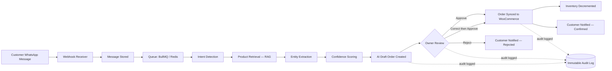
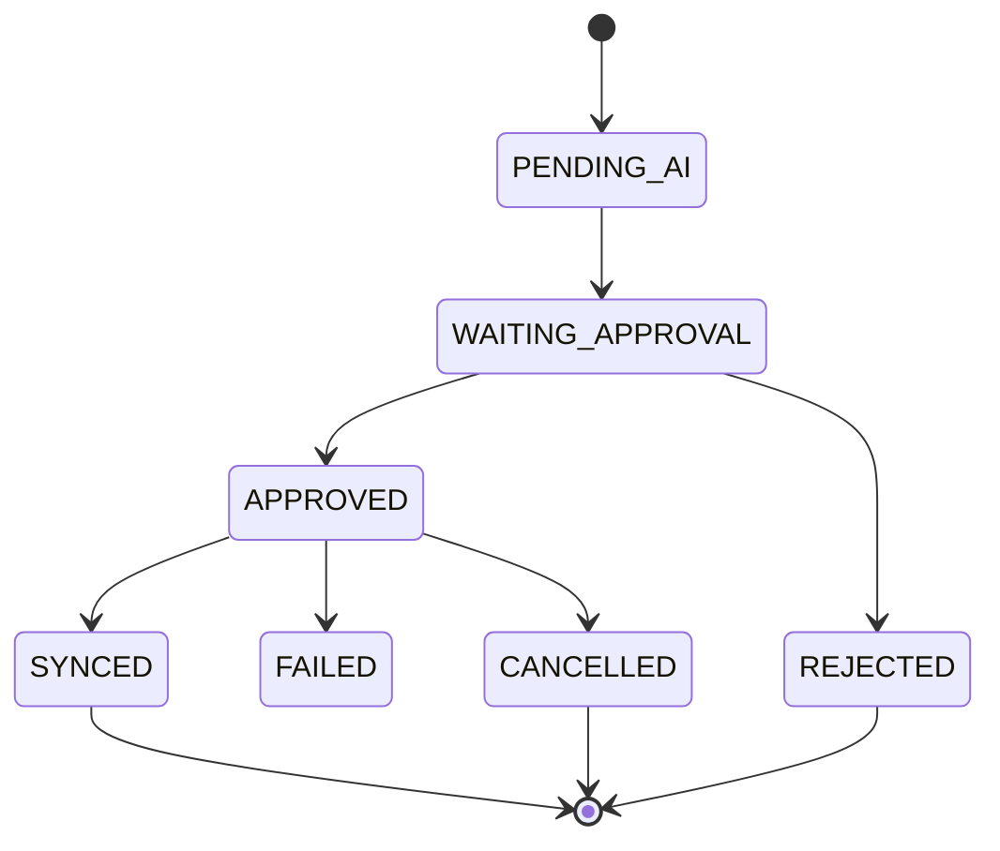

# CommercePilot

**The AI Automation Layer for Existing E-commerce Businesses**

CommercePilot turns WhatsApp order chaos into a governed, auditable pipeline — without replacing the store a business already runs. It reads incoming WhatsApp messages, uses AI (Gemini) to understand intent and extract structured orders against a tenant's real product catalogue (RAG, never invented products), scores its own confidence, and hands every order to the business owner for a final human decision before anything is written back to WooCommerce.

> AI recommends. Humans decide. Every action is audited.

[](https://nestjs.com/)
[](https://nextjs.org/)
[](https://www.typescriptlang.org/)
[](https://www.postgresql.org/)
[](https://www.prisma.io/)
[](https://redis.io/)
[](#license)

---

## Table of Contents

- [Overview](#overview)
- [How It Works](#how-it-works)
- [Core Modules](#core-modules)
- [Tech Stack](#tech-stack)
- [Architecture](#architecture)
- [Project Structure](#project-structure)
- [Getting Started](#getting-started)
- [API Reference](#api-reference)
- [Testing](#testing)
- [Security](#security)
- [Business Rules & AI Governance](#business-rules--ai-governance)
- [Project Status](#project-status)
- [Roadmap](#roadmap)
- [Internal Documentation](#internal-documentation)
- [License](#license)

---

## Overview

Most small and medium e-commerce businesses already run WooCommerce (or a similar store) — their real bottleneck is that a huge share of orders arrive as free-form WhatsApp messages, which someone has to read, interpret, check against stock, and re-enter by hand.

CommercePilot is **not** a new storefront and **not** a chatbot. It is an AI employee that sits between WhatsApp and the existing store:

- Understands what a customer is asking for, in natural language.
- Matches it against the tenant's **real** product catalogue via retrieval-augmented generation — it is architecturally incapable of inventing a product that doesn't exist in the catalogue.
- Produces a structured draft order with a calculated confidence score.
- Puts the business owner in the loop for approval, correction, or rejection.
- Only after human approval does it write the order back to WooCommerce, adjust inventory, and notify the customer.
- Logs every step — every AI decision, every owner action — to an immutable audit trail.

## How It Works



Every stage of the AI pipeline (intent → RAG → extraction → confidence) is logged to `AIProcessingLog` with the model used, input/output payloads, and processing time — so any AI decision can be explained and replayed, not just trusted blindly.

## Core Modules

| Module | Responsibility | Status |
|---|---|---|
| **Auth** | Registration, JWT login/refresh/logout, RBAC (`SUPER_ADMIN`, `OWNER`, `STAFF`) | ✅ Shipped |
| **WhatsApp** | Webhook ingestion, message storage, dev simulator (no Meta account required) | ✅ Shipped |
| **AI Engine** | Intent detection → RAG product retrieval → entity extraction → confidence scoring → conflict resolution | ✅ Shipped |
| **Orders** | Draft generation, owner approve/reject/correct workflow, order state machine, live SSE order events | ✅ Shipped |
| **Products** | Tenant product catalogue — the single source of truth the AI is allowed to match against | ✅ Shipped |
| **Customers** | Auto-created/matched by WhatsApp number, order & conversation history | ✅ Shipped |
| **Integrations** | WooCommerce product sync + idempotent order sync, adapter-isolated for future platforms | ✅ Shipped |
| **Notifications** | Owner + customer notifications (email via MailHog/Resend, in-app feed) | ✅ Shipped |
| **Audit Logs** | Immutable, queryable trail of every state-changing action | ✅ Shipped |
| **Users** | Owner-operated team management with privilege-escalation and self-lockout guards | ✅ Shipped |
| **Admin** | Cross-tenant platform operations for `SUPER_ADMIN` (tenant list, stats, suspend/activate) | ✅ Shipped |
| **Tenant Settings** | Encrypted integration credentials (AES-256-GCM), per-tenant configuration | ✅ Shipped |
| AI Customer Support | Autonomous FAQ / support handling | 🔜 Future |
| Abandoned Cart Recovery | Automated re-engagement | 🔜 Future |
| Shopify / Instagram / Messenger | Additional channel & platform integrations | 🔜 Future |

## Tech Stack

| Layer | Technology |
|---|---|
| **Frontend** | Next.js 16 (App Router), React 19, TypeScript, Tailwind CSS 4, Recharts, Playwright (E2E) |
| **Backend** | NestJS 11, TypeScript (strict), class-validator/class-transformer, Passport-JWT, Helmet, Swagger/OpenAPI |
| **Database** | PostgreSQL 16 + `pgvector` (for AI product embeddings), Prisma ORM, migration-based schema |
| **Queue / Cache** | Redis 7, BullMQ (AI processing, retries, scheduled jobs) |
| **AI** | Google Gemini (`gemini-2.5-flash`), `text-embedding-004` for RAG — mock extractor fallback with no API key |
| **Integrations** | WooCommerce REST API, WhatsApp Cloud API (Meta Graph), SMTP email (MailHog in dev / Resend in prod) |
| **Infra (local)** | Docker Compose — Postgres, Redis, MailHog |

## Architecture

CommercePilot is a **Modular Monolith** built on **Clean Architecture**, chosen deliberately over microservices for the MVP: it gives production-grade maintainability without the operational overhead of a distributed system, while keeping module boundaries clean enough to extract services later if scale demands it.

```
Presentation (Controllers)
        ↓
Application (Services — business logic lives here, never in controllers)
        ↓
Domain (Models, business rules, state machines)
        ↓
Infrastructure (Prisma repositories, external API adapters)
```

**Non-negotiable architectural rules enforced across the codebase:**

- Dependencies flow inward only — infrastructure never contains business rules.
- Every external dependency (email, WhatsApp, WooCommerce, AI) sits behind an interface (`IEmailService`, `IEcommerceAdapter`, `IWhatsAppAdapter`) — swapping providers never touches business logic.
- **Multi-tenancy is mandatory.** Every table carries `tenant_id`; every query filters by it. No cross-tenant access, no exceptions.
- No module reaches into another module's database tables — cross-module communication goes through service interfaces and domain events (`OrderApproved`, `DraftOrderCreated`, `OrderSynced`, etc.).
- Nothing is hard-deleted from business tables — soft delete via `deleted_at` only.
- All primary keys are UUIDv4, generated in the backend, never in the database.
- The audit log is append-only. It is never updated or deleted.

## Project Structure

```
CommercePilot/
├── backend/                     # NestJS API
│   ├── prisma/
│   │   ├── schema.prisma        # Tenant, User, Customer, Product, Order, OrderItem,
│   │   │                        # WhatsAppMessage, Conversation, AIProcessingLog,
│   │   │                        # AIDraftOrder(+Items), InventoryTransaction,
│   │   │                        # Notification, AuditLog
│   │   └── migrations/
│   ├── docker/postgres/init.sql # pgvector + uuid-ossp extensions
│   └── src/
│       ├── modules/
│       │   ├── auth/  users/  admin/  tenant-settings/
│       │   ├── whatsapp/  conversations/  customers/
│       │   ├── ai-engine/
│       │   │   ├── adapters/gemini.adapter.ts
│       │   │   └── pipeline/  # intent-detector, product-retriever (RAG),
│       │   │                  # entity-extractor, confidence-scorer, conflict-resolver
│       │   ├── orders/  products/
│       │   ├── integrations/
│       │   │   ├── adapters/woocommerce.adapter.ts
│       │   │   └── services/ # product-sync, order-sync (idempotent)
│       │   ├── notifications/  audit-logs/
│       │   └── common/         # EncryptionService (AES-256-GCM), shared guards
│       └── main.ts
├── frontend/                    # Next.js dashboard
│   ├── src/app/
│   │   ├── login/  register/
│   │   └── dashboard/
│   │       ├── orders/  products/  customers/
│   │       ├── simulator/          # WhatsApp conversation simulator (no Meta account needed)
│   │       ├── analytics/  notifications/  settings/
│   └── e2e/                     # Playwright: auth, order-flow, regression suites
├── docker-compose.yml            # Postgres (pgvector) + Redis + MailHog
└── Documents/                    # Source-of-truth specs (PRD, architecture, security, business rules)
```

## Getting Started

### Prerequisites

- Node.js 20+ and npm
- Docker Desktop (running)
- A [Google AI Studio](https://aistudio.google.com/app/apikey) API key for real AI extraction (optional — a mock extractor is used automatically if omitted)

### 1. Clone and install

```bash
git clone https://github.com/DininduAkalanka/CommercePilot-Multi-Tenant-SaaS-Commerce-Automation-Platform.git
cd CommercePilot-Multi-Tenant-SaaS-Commerce-Automation-Platform

cd backend && npm install
cd ../frontend && npm install
```

### 2. Configure environment variables

```bash
cd backend
cp .env.example .env
```

Fill in at minimum:

| Variable | Purpose |
|---|---|
| `DATABASE_URL` | PostgreSQL connection string (Docker default: port `5433` on host) |
| `JWT_SECRET` | Long random string — signs access/refresh tokens |
| `ENCRYPTION_KEY` | 64 hex chars (`openssl rand -hex 32`) — encrypts stored integration credentials (AES-256-GCM) |
| `GEMINI_API_KEY` | Optional — omit to run the AI pipeline in mock mode |
| `WHATSAPP_PROVIDER` / `WOOCOMMERCE_PROVIDER` | Leave as `mock` for local dev; the built-in simulator and mock adapter need no external accounts |

Everything else has sane local defaults — see `backend/.env.example` for the full annotated list (Redis, MailHog, WooCommerce, WhatsApp Cloud API).

### 3. Start infrastructure

```bash
docker compose up -d
```

Brings up Postgres (with `pgvector`), Redis, and MailHog (a local email catcher — no real SMTP account needed in dev).

### 4. Apply database migrations

```bash
cd backend
npx prisma migrate deploy
```

### 5. Run the app

```bash
# Terminal 1 — backend (http://localhost:3001)
cd backend && npm run start:dev

# Terminal 2 — frontend (http://localhost:3000)
cd frontend && npm run dev
```

### Local service map

| Service | URL |
|---|---|
| Dashboard | http://localhost:3000 |
| API | http://localhost:3001/api/v1 |
| Swagger / OpenAPI docs | http://localhost:3001/api/docs |
| MailHog (dev email inbox) | http://localhost:8025 |
| PostgreSQL | `localhost:5433` |
| Redis | `localhost:6379` |

No WhatsApp Business account is required to try the product end to end — the dashboard's **WhatsApp Simulator** posts messages straight into the same pipeline a real Meta webhook would trigger.

## API Reference

All endpoints are versioned under `/api/v1`, documented interactively via Swagger at `/api/docs`, and follow one consistent envelope:

```jsonc
// Success
{ "success": true, "message": "Order created successfully.", "data": {}, "meta": {} }

// Failure
{ "success": false, "message": "Validation failed.", "errors": [] }
```

| Resource | Endpoints |
|---|---|
| **Auth** | `POST /auth/register` · `POST /auth/login` · `POST /auth/refresh` · `POST /auth/logout` · `GET /auth/me` |
| **WhatsApp** | `GET|POST /whatsapp/webhook` · `POST /whatsapp/simulator/send` · `GET /whatsapp/simulator/messages` |
| **Orders** | `GET /orders` · `GET /orders/stats` · `GET /orders/analytics` · `GET /orders/recent-activity` · `GET /orders/events` (SSE) · `GET /orders/drafts` · `GET /orders/drafts/:id` · `PATCH /orders/drafts/:id/approve` · `PATCH /orders/drafts/:id/reject` · `PATCH /orders/drafts/:id/correct` |
| **Products** | `GET|POST /products` · `GET|PATCH|DELETE /products/:id` |
| **Customers** | `GET /customers` · `GET /customers/:id` · `GET /customers/:id/orders` · `GET /customers/:id/messages` |
| **Integrations** | `POST /integrations/woocommerce/sync` |
| **Notifications** | `GET /notifications` · `PATCH /notifications/:id/read` |
| **Settings** | `GET|PATCH /settings` |
| **Users** | `GET|POST /users` · `GET|PATCH|DELETE /users/:id` |
| **Audit Logs** | `GET /audit-logs` · `GET /audit-logs/:entityType/:entityId` |
| **Admin** (`SUPER_ADMIN` only) | `GET /admin/tenants` · `GET /admin/stats` · `PATCH /admin/tenants/:id/status` |

Authentication is a `Bearer <JWT>` header only — no query-string tokens are accepted anywhere, including the SSE order-events stream.

## Testing

```bash
# Backend — unit + integration (Jest)
cd backend && npm run test
cd backend && npm run test:cov

# Frontend — end-to-end (Playwright)
cd frontend && npm run test:e2e
```

The Playwright suite (`frontend/e2e/`) is hermetic — each spec registers its own throwaway tenant against the live API and runs against the mock WhatsApp/AI/WooCommerce providers, so it needs no external accounts and leaves no shared state:

- `auth.spec.ts` — register → dashboard → logout → login, invalid-credentials path
- `order-flow.spec.ts` — the core success path: simulator message → AI draft → owner correction → approval → synced order
- `regression.spec.ts` — pins down previously-fixed defects so they can't silently reappear

## Security

Security is treated as a first-class architectural concern, not an afterthought (see [`SECURITY.md.pdf`](Documents/SECURITY.md.pdf) for the full constitution). Highlights:

- **JWT auth** with short-lived access tokens and secure refresh tokens; RBAC enforced server-side on every endpoint — the frontend never gets to decide authorization.
- **Strict tenant isolation** — every repository query is scoped by `tenant_id`; cross-tenant access is treated as a critical bug, not an edge case.
- **Encryption at rest** for Restricted data (WhatsApp tokens, WooCommerce keys) via AES-256-GCM, versioned envelope for future key rotation.
- **Input validation everywhere** via `class-validator` DTOs; Prisma-only data access (no raw SQL, no injection surface).
- **Rate limiting** (`@nestjs/throttler`) on public and auth-sensitive endpoints.
- **Webhook signature verification** for Meta WhatsApp payloads.
- **Sanitized error responses** — stack traces, DB errors, and internals are never exposed to clients.
- **Prompt-injection awareness** — customer messages are treated as untrusted input; the AI is instructed to ignore attempts to reveal or override its system instructions, and only ever receives the minimum data needed (message + relevant catalogue slice), never secrets or credentials.

## Business Rules & AI Governance

CommercePilot's business logic is governed by a versioned "business constitution" ([`BUSINESS_RULES.md.pdf`](Documents/BUSINESS_RULES.md.pdf)). The core invariant: **AI recommends, the owner decides.**

**Confidence-driven review:**

| Confidence Score | Behavior |
|---|---|
| 0.95 – 1.00 | Draft created automatically for review |
| 0.80 – 0.94 | Owner review explicitly recommended |
| < 0.80 | Manual confirmation required before an order can be created |

**Order lifecycle:**



**What the AI is permitted to do:** read messages, detect intent, extract order data, match products against the tenant's real catalogue via RAG, calculate confidence, draft a reply.

**What the AI is never permitted to do:** invent a product that isn't in the catalogue, approve an order, change inventory directly, delete any record, modify business settings, or override an owner's decision. Inventory is only ever decremented once — after approval **and** successful WooCommerce sync, never before, and never twice.

## Project Status

Currently at **Phase 8 — Frontend Completion & E2E** of a phase-based delivery model (full history in [`CHANGELOG.md`](CHANGELOG.md)):

- Backend: full test suite green, clean `tsc --noEmit` and `nest build`.
- Frontend: clean `tsc --noEmit` and production `next build` across all routes.
- Full page audit performed against the live backend (Dashboard, Orders, Products, Customers, Simulator, Notifications, Analytics, Settings, Auth) with zero console errors and zero failed network requests.
- The full success-criterion flow — **WhatsApp message → AI draft → owner correction → approval → real WooCommerce order → customer confirmation** — has been verified end-to-end against a live WooCommerce store, not just mocks.

**Known, tracked gaps** (see `CHANGELOG.md` for details, not undiscovered bugs):
- Self-service registration password policy is not yet aligned with the ≥12-character/complexity policy enforced elsewhere (`SECURITY.md` §14).
- Real Gemini AI extraction requires a billing-enabled Google AI Studio key; without one, the system correctly and intentionally falls back to a lower-quality mock extractor rather than failing.

## Roadmap

**Phase 2**
- Shopify integration
- Facebook Messenger & Instagram DM channels
- Sinhala language support
- Voice message processing

**Phase 3**
- Inventory prediction & AI sales forecasting
- Marketing automation
- Courier/logistics integration
- Plugin marketplace

## Internal Documentation

The `Documents/` folder holds the source-of-truth specification the codebase is built against — read these before making architectural changes:

| Document | Covers |
|---|---|
| [`PRODUCT_VISION.md.pdf`](Documents/PRODUCT_VISION.md.pdf) | Product philosophy, target customers, success metrics |
| [`Product Requirements Document - CommercePilot.pdf`](Documents/Product%20Requirements%20Document%20-%20CommercePilot.pdf) | Full PRD — scope, user stories, acceptance criteria |
| [`PROJECT_CONTEXT.md.pdf`](Documents/PROJECT_CONTEXT.md.pdf) | Project identity, mission, technology stack rationale |
| [`SYSTEM_ARCHITECTURE.md.pdf`](Documents/SYSTEM_ARCHITECTURE.md.pdf) | Architecture style, module boundaries, event catalogue |
| [`DATABASE_ARCHITECTURE.md.pdf`](Documents/DATABASE_ARCHITECTURE.md.pdf) | Schema philosophy, multi-tenant strategy, indexing rules |
| [`BUSINESS_RULES.md.pdf`](Documents/BUSINESS_RULES.md.pdf) | The business-logic constitution — takes precedence over code if they ever disagree |
| [`API Guidelines.pdf`](Documents/API%20Guidelines.pdf) | REST conventions, response envelopes, versioning |
| [`SECURITY.md.pdf`](Documents/SECURITY.md.pdf) | The security constitution |
| [`MASTER_SYSTEM_PROMPT.md.pdf`](Documents/MASTER_SYSTEM_PROMPT.md.pdf) | The engineering operating procedure this codebase was built under |

## License

This project is currently **proprietary / unlicensed for public use** (see `package.json`). All rights reserved by the author. Contact the repository owner for licensing or collaboration inquiries.

---

<div align="center">

Built as a production-grade AI commerce automation platform — not a demo.

</div>
