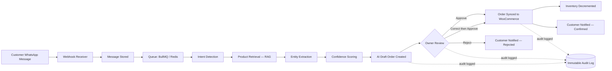
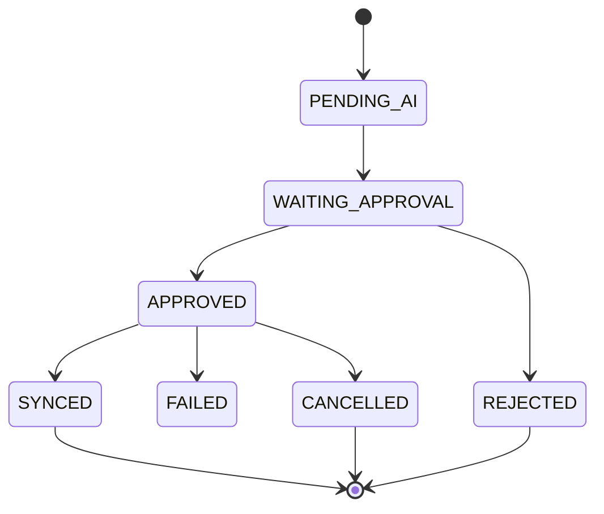

# CommercePilot

**Multi-Tenant SaaS Order Automation for WhatsApp-First Businesses**

Small shops across South Asia take most of their orders on WhatsApp, by hand,
one message at a time. CommercePilot reads those messages, works out what the
customer wants, checks real stock, and prepares the order — then waits for the
shop owner to approve it.

Nothing ships without a human saying yes.

> AI recommends. Humans decide. Every action is audited.

[](https://nestjs.com/)
[](https://nextjs.org/)
[](https://www.typescriptlang.org/)
[](https://www.postgresql.org/)
[](https://www.prisma.io/)
[](https://redis.io/)
[](#testing)
[](#license)

---

## Table of Contents

- [Overview](#overview)
- [How It Works](#how-it-works)
- [Core Modules](#core-modules)
- [Tech Stack](#tech-stack)
- [Architecture](#architecture)
- [Language Support](#language-support)
- [Project Structure](#project-structure)
- [Getting Started](#getting-started)
- [API Reference](#api-reference)
- [Testing](#testing)
- [Security](#security)
- [Business Rules & AI Governance](#business-rules--ai-governance)
- [Project Status](#project-status)
- [Roadmap](#roadmap)
- [Documentation](#documentation)
- [License](#license)

---

## Overview

### The problem

In Sri Lanka and across South Asia, small shops do not sell through websites.
**They sell through WhatsApp.**

A typical day for a clothing shop owner:

1. Posts a product photo on Facebook or Instagram
2. Forty people message WhatsApp — *"Do you have this?"*, *"What's the
   price?"*, *"Is size L available?"*
3. The owner answers each one by hand, on their phone
4. Checks stock from memory, or by walking to the shelf
5. Writes the order in a notebook — or just remembers it
6. At 11pm, types the day's orders into their system

Five things go wrong, every day:

| What happens | What it costs |
|---|---|
| Messages arrive faster than one person can reply | A customer waits two hours and buys elsewhere |
| Messages arrive at night, or while serving a walk-in | Answered next morning; many are already gone |
| *"Do you have blue in L?"* answered from memory | Stock promised that cannot ship → refund, bad review |
| An impatient customer messages twice | Two parcels shipped, one comes back |
| Orders live inside chat threads | No records, no reporting, no proof in a dispute |

The deepest problem is invisible: **the owner never finds out what they lost.**
The customer who waited forty minutes and left appears in no report.

### What CommercePilot does

It sits between WhatsApp and the store the business already runs — reading each
message, working out what the customer wants, checking real stock, and
preparing the order.

**The owner taps approve.** The order lands in WooCommerce.

It is **not** a new storefront and **not** a chatbot. Think of it as an
assistant that does the typing while the owner keeps the decisions.

```
Customer message  →  AI reads it  →  Draft order  →  Owner approves  →  Real order
                                          ↑
                              nothing ships without this
```

### What changes for the shop owner

| Before | After |
|---|---|
| ~2 minutes per message, 50 messages a day — **1.7 hours** | Review a prepared draft in ~10 seconds |
| Stock checked from memory | Stock checked per size and colour before the order exists |
| Orders re-typed into the system at night | Approved orders reach WooCommerce directly |
| No idea which products customers wanted | Every unmatched request logged and ranked by how many people asked |
| Duplicate orders discovered after shipping | Likely repeats flagged for review first |

The reporting side is quietly the most valuable. Today a shop owner has no way
to know what they are failing to sell. CommercePilot records every request the
catalogue could not match — turning stocking decisions from guesswork into data.

### What changes for the customer

| Before | After |
|---|---|
| Waits minutes to hours for a reply | Answered in seconds, at any hour |
| Told an item is available, then it isn't | Availability checked against real per-variant stock |
| Writes in Sinhala or Singlish and is misunderstood | English, Sinhala and Singlish all handled |
| *"We don't have that"* — conversation ends | Offered up to three close **in-stock** alternatives |
| Stuck in a loop with a bot that cannot help | Handed to a real person after two failed attempts |

### Why a human still approves

The AI drafts; it does not send. Every order waits for the owner unless they
explicitly enable auto-approval, and even then only above 95% confidence.

That single decision is what makes the system safe to trust. An AI mistake
costs a few seconds of review instead of a wrong delivery, a refund, and a lost
customer — and the owner sees the customer's original message beside every
draft, so a misread order is caught in one glance.

## How It Works



Every stage of the AI pipeline (intent → RAG → extraction → confidence) is logged to `AIProcessingLog` with the model used, input/output payloads, and processing time — so any AI decision can be explained and replayed, not just trusted blindly.

## Core Modules

| Module | Responsibility | Status |
|---|---|---|
| **Auth** | Registration, JWT login/refresh/logout, RBAC (`SUPER_ADMIN`, `OWNER`, `STAFF`) | ✅ Shipped |
| **WhatsApp** | Webhook ingestion, message storage, dev simulator (no Meta account required) | ✅ Shipped |
| **AI Engine** | Intent detection → RAG product retrieval → entity extraction → confidence scoring → conflict resolution | ✅ Shipped |
| **Orders** | Draft generation, owner approve/reject/correct workflow, order state machine, live SSE order events | ✅ Shipped |
| **Products** | Tenant product catalogue — the single source of truth the AI is allowed to match against | ✅ Shipped |
| **Customers** | Auto-created/matched by WhatsApp number, order & conversation history | ✅ Shipped |
| **Integrations** | WooCommerce product sync + idempotent order sync, adapter-isolated for future platforms | ✅ Shipped |
| **Notifications** | Owner + customer notifications (email via MailHog/Resend, in-app feed) | ✅ Shipped |
| **Audit Logs** | Immutable, queryable trail of every state-changing action | ✅ Shipped |
| **Users** | Owner-operated team management with privilege-escalation and self-lockout guards | ✅ Shipped |
| **Admin** | Cross-tenant platform operations for `SUPER_ADMIN` (tenant list, stats, suspend/activate) | ✅ Shipped |
| **Tenant Settings** | Encrypted integration credentials (AES-256-GCM), per-tenant configuration | ✅ Shipped |
| **Product Variants** | Per-combination stock (size × colour), canonical attribute keys, dashboard management | ✅ Shipped |
| **Conversations** | Multi-turn state, human handoff after repeated failed clarifications | ✅ Shipped |
| **Query Normalisation** | Sinhala/Tamil messages translated to English before retrieval | ✅ Shipped |
| **Unfulfilled Demand** | Every unmatched request logged and ranked by distinct customers | ✅ Shipped |
| **Duplicate Detection** | Flags likely repeat orders for review rather than shipping twice | ✅ Shipped |
| **AI Metrics** | Per-stage pipeline health, confidence distribution, correction rate | ✅ Shipped |
| AI Customer Support | Autonomous FAQ / support handling | 🔜 Future |
| Abandoned Cart Recovery | Automated re-engagement | 🔜 Future |
| Voice notes | Whisper transcription — model available on the current key, pipeline work outstanding | 🔜 Future |
| Billing & plan enforcement | `TenantPlan` is modelled but never enforced | 🔜 Future |
| Shopify / Instagram / Messenger | Additional channel & platform integrations | 🔜 Future |

## Tech Stack

| Layer | Technology |
|---|---|
| **Frontend** | Next.js 16 (App Router), React 19, TypeScript, Tailwind CSS 4, Recharts, Playwright (E2E) |
| **Backend** | NestJS 11, TypeScript (strict), class-validator/class-transformer, Passport-JWT, Helmet, Swagger/OpenAPI |
| **Database** | PostgreSQL 16 + `pgvector` (for AI product embeddings), Prisma ORM, migration-based schema |
| **Queue / Cache** | Redis 7, BullMQ (AI processing, retries, scheduled jobs) |
| **AI** | Provider-agnostic behind `AiAdapter` — Groq (`llama-3.3-70b-versatile`) in use, Gemini selectable; stage-aware mock with no key |
| **Embeddings** | Separate `EmbeddingProvider` interface — Jina `jina-embeddings-v3` at 768 dims, or `none` (text search) |
| **Integrations** | WooCommerce REST API, WhatsApp Cloud API (Meta Graph), SMTP email (MailHog in dev / Resend in prod) |
| **Infra (local)** | Docker Compose — Postgres, Redis, MailHog |
| **Hosting** | Render (API, Docker) · Vercel (dashboard) · Neon (Postgres) · Upstash (Redis) |

Full detail in [`TECHNOLOGY.md`](TECHNOLOGY.md) — every dependency, why it was chosen, and the version-specific traps found along the way.

## Architecture

CommercePilot is a **Modular Monolith** built on **Clean Architecture**, chosen deliberately over microservices for the MVP: it gives production-grade maintainability without the operational overhead of a distributed system, while keeping module boundaries clean enough to extract services later if scale demands it.

```
Presentation (Controllers)
        ↓
Application (Services — business logic lives here, never in controllers)
        ↓
Domain (Models, business rules, state machines)
        ↓
Infrastructure (Prisma repositories, external API adapters)
```

**Non-negotiable architectural rules enforced across the codebase:**

- Dependencies flow inward only — infrastructure never contains business rules.
- Every external dependency (email, WhatsApp, WooCommerce, AI) sits behind an interface (`IEmailService`, `IEcommerceAdapter`, `IWhatsAppAdapter`) — swapping providers never touches business logic.
- **Multi-tenancy is mandatory.** Every table carries `tenant_id`; every query filters by it. No cross-tenant access, no exceptions.
- No module reaches into another module's database tables — cross-module communication goes through service interfaces and domain events (`OrderApproved`, `DraftOrderCreated`, `OrderSynced`, etc.).
- Nothing is hard-deleted from business tables — soft delete via `deleted_at` only.
- All primary keys are UUIDv4, generated in the backend, never in the database.
- The audit log is append-only. It is never updated or deleted.

[`ARCHITECTURE.md`](ARCHITECTURE.md) covers the request lifecycle, the six-stage AI pipeline, the provider abstraction, the expand/contract variant rollout, and verified failure behaviour.

## Language Support

Customers write in English, Sinhala, and Singlish (Sinhala in Latin script).
Each behaves differently, and the system handles them differently:

| Input | Handling |
|---|---|
| **English** | Retrieval and extraction directly. |
| **Singlish** — `mata blue shirt ekak one` | Passed through unchanged. Measured at 0.628 retrieval similarity with a 0.322 margin — it already works, and rewriting it would risk a downgrade. |
| **Sinhala** — `මට නිල් ෂර්ට් එකක් ඕන` | Translated to a short English search phrase **before retrieval only**. |

Sinhala needed the extra step for a concrete reason: text search tokenises on
`[^a-z0-9]`, so Sinhala script produced **zero** search terms and matched
nothing. Embedding the raw script did not help either — measured against real
catalogue text, Sinhala queries ranked the same unrelated product first every
time, with margins of 0.005–0.035.

Normalising first fixed both paths: vector margin 0.010 → 0.421, text terms
0 → 2.

**Extraction still receives the original message.** Normalisation deliberately
discards quantity, size and politeness; a draft built from the normalised text
would silently lose the "2" the customer asked for.

## Project Structure

```
CommercePilot/
├── backend/                     # NestJS API
│   ├── prisma/
│   │   ├── schema.prisma        # Tenant, User, Customer, Product, Order, OrderItem,
│   │   │                        # WhatsAppMessage, Conversation, AIProcessingLog,
│   │   │                        # AIDraftOrder(+Items), InventoryTransaction,
│   │   │                        # Notification, AuditLog
│   │   └── migrations/
│   ├── docker/postgres/init.sql # pgvector + uuid-ossp extensions
│   └── src/
│       ├── modules/
│       │   ├── auth/  users/  admin/  tenant-settings/
│       │   ├── whatsapp/  conversations/  customers/
│       │   ├── ai-engine/
│       │   │   ├── adapters/gemini.adapter.ts
│       │   │   └── pipeline/  # intent-detector, product-retriever (RAG),
│       │   │                  # entity-extractor, confidence-scorer, conflict-resolver
│       │   ├── orders/  products/
│       │   ├── integrations/
│       │   │   ├── adapters/woocommerce.adapter.ts
│       │   │   └── services/ # product-sync, order-sync (idempotent)
│       │   ├── notifications/  audit-logs/
│       │   └── common/         # EncryptionService (AES-256-GCM), shared guards
│       └── main.ts
├── frontend/                    # Next.js dashboard
│   ├── src/app/
│   │   ├── login/  register/
│   │   └── dashboard/
│   │       ├── orders/  products/  customers/
│   │       ├── simulator/          # WhatsApp conversation simulator (no Meta account needed)
│   │       ├── analytics/  notifications/  settings/
│   └── e2e/                     # Playwright: auth, order-flow, regression suites
├── docker-compose.yml            # Postgres (pgvector) + Redis + MailHog
└── Documents/                    # Source-of-truth specs (PRD, architecture, security, business rules)
```

## Getting Started

### Prerequisites

- Node.js 20+ and npm
- Docker Desktop (running)
- A [Google AI Studio](https://aistudio.google.com/app/apikey) API key for real AI extraction (optional — a mock extractor is used automatically if omitted)

### 1. Clone and install

```bash
git clone https://github.com/DininduAkalanka/CommercePilot-Multi-Tenant-SaaS-Commerce-Automation-Platform.git
cd CommercePilot-Multi-Tenant-SaaS-Commerce-Automation-Platform

cd backend && npm install
cd ../frontend && npm install
```

### 2. Configure environment variables

```bash
cd backend
cp .env.example .env
```

Fill in at minimum:

| Variable | Purpose |
|---|---|
| `DATABASE_URL` | PostgreSQL connection string (Docker default: port `5433` on host) |
| `JWT_SECRET` | Long random string — signs access/refresh tokens |
| `ENCRYPTION_KEY` | 64 hex chars (`openssl rand -hex 32`) — encrypts stored integration credentials (AES-256-GCM) |
| `AI_PROVIDER` | `groq` (default) or `gemini` |
| `GROQ_API_KEY` | Optional — omit to run the pipeline on the built-in mock |
| `WHATSAPP_PROVIDER` / `WOOCOMMERCE_PROVIDER` | Leave as `mock` for local dev; the simulator and mock adapter need no external accounts |

**The app runs fully without any AI key.** A stage-aware mock responds instead, so a fresh clone works end to end — that is also how CI runs the E2E suite, deterministically and at no cost.

Everything else has sane local defaults — see `backend/.env.example` for the full annotated list (Redis, MailHog, WooCommerce, WhatsApp Cloud API, and every feature flag).

Behaviour is controlled by flags so anything can be reverted without a deploy:

| Flag | Default | Effect |
|---|---|---|
| `VARIANT_STOCK_ENABLED` | `false` | Read stock per size/colour rather than the product total. **Run `npm run backfill:variants` before enabling** |
| `QUERY_NORMALIZATION_ENABLED` | `true` | Translate Sinhala/Tamil messages before retrieval |
| `SOFT_ALTERNATIVES_ENABLED` | `true` | Offer close in-stock alternatives instead of a dead end |
| `DUPLICATE_DETECTION_ENABLED` | `true` | Flag likely repeat orders for review |
| `HANDOFF_ENABLED` | `true` | Escalate to a human after repeated failed clarifications |
| `EMBEDDING_PROVIDER` | `none` | `jina` for semantic search, `none` for text matching |

### 3. Start infrastructure

```bash
docker compose up -d
```

Brings up Postgres (with `pgvector`), Redis, and MailHog (a local email catcher — no real SMTP account needed in dev).

### 4. Apply database migrations

```bash
cd backend
npx prisma migrate deploy
```

### 5. Run the app

```bash
# Terminal 1 — backend (http://localhost:3001)
cd backend && npm run start:dev

# Terminal 2 — frontend (http://localhost:3000)
cd frontend && npm run dev
```

### Local service map

| Service | URL |
|---|---|
| Dashboard | http://localhost:3000 |
| API | http://localhost:3001/api/v1 |
| Swagger / OpenAPI docs | http://localhost:3001/api/docs |
| MailHog (dev email inbox) | http://localhost:8025 |
| PostgreSQL | `localhost:5433` |
| Redis | `localhost:6379` |

No WhatsApp Business account is required to try the product end to end — the dashboard's **WhatsApp Simulator** posts messages straight into the same pipeline a real Meta webhook would trigger.

## API Reference

All endpoints are versioned under `/api/v1`, documented interactively via Swagger at `/api/docs`, and follow one consistent envelope:

```jsonc
// Success
{ "success": true, "message": "Order created successfully.", "data": {}, "meta": {} }

// Failure
{ "success": false, "message": "Validation failed.", "errors": [] }
```

| Resource | Endpoints |
|---|---|
| **Auth** | `POST /auth/register` · `POST /auth/login` · `POST /auth/refresh` · `POST /auth/logout` · `GET /auth/me` |
| **WhatsApp** | `GET|POST /whatsapp/webhook` · `POST /whatsapp/simulator/send` · `GET /whatsapp/simulator/messages` |
| **Orders** | `GET /orders` · `GET /orders/stats` · `GET /orders/analytics` · `GET /orders/recent-activity` · `GET /orders/events` (SSE) · `GET /orders/drafts` · `GET /orders/drafts/:id` · `PATCH /orders/drafts/:id/approve` · `PATCH /orders/drafts/:id/reject` · `PATCH /orders/drafts/:id/correct` |
| **Products** | `GET|POST /products` · `GET|PATCH|DELETE /products/:id` |
| **Variants** | `GET|POST /products/:productId/variants` · `PATCH|DELETE /products/:productId/variants/:variantId` |
| **AI Engine** | `GET /ai-engine/metrics` · `GET /ai-engine/unfulfilled-demand` |
| **Customers** | `GET /customers` · `GET /customers/:id` · `GET /customers/:id/orders` · `GET /customers/:id/messages` |
| **Integrations** | `POST /integrations/woocommerce/sync` |
| **Notifications** | `GET /notifications` · `PATCH /notifications/:id/read` |
| **Settings** | `GET|PATCH /settings` |
| **Users** | `GET|POST /users` · `GET|PATCH|DELETE /users/:id` |
| **Audit Logs** | `GET /audit-logs` · `GET /audit-logs/:entityType/:entityId` |
| **Admin** (`SUPER_ADMIN` only) | `GET /admin/tenants` · `GET /admin/stats` · `PATCH /admin/tenants/:id/status` |
| **Health** | `GET /health` (liveness) · `GET /health/ready` (readiness — checks the database) |

Authentication is a `Bearer <JWT>` header only — no query-string tokens are accepted anywhere, including the SSE order-events stream.

Resource ids are validated as UUIDs at the route boundary, so a malformed id returns `400` rather than reaching the ORM.

Swagger is **disabled in production** — `/api/docs` returns `404` outside development.

## Testing

```bash
# Backend — unit + integration (Jest)
cd backend && npm run test
cd backend && npm run test:cov

# Frontend — end-to-end (Playwright)
cd frontend && npm run test:e2e
```

The Playwright suite (`frontend/e2e/`) is hermetic — each spec registers its own throwaway tenant against the live API and runs against the mock WhatsApp/AI/WooCommerce providers, so it needs no external accounts and leaves no shared state:

| Spec | Covers |
|---|---|
| `auth.spec.ts` | register → dashboard → logout → login; invalid credentials |
| `order-flow.spec.ts` | the core path: simulator message → AI draft → owner correction → approval → synced order |
| `human-handoff.spec.ts` | escalation after repeated failures, notify-once, and no false escalation |
| `ai-performance.spec.ts` | assistant page states and endpoint authorisation |
| `regression.spec.ts` | previously-fixed defects, pinned so they cannot silently reappear |
| `responsive-audit.spec.ts` | no horizontal overflow at 360/375/768px, 44px tap targets, panel positioning |
| `throttle-exemptions.spec.ts` | health and webhook survive bursts; ordinary routes stay rate limited |

**Current state:** 376 backend unit tests across 36 suites, 22 end-to-end tests, zero TypeScript or ESLint errors in either app.

Overall backend statement coverage is 52.93%, concentrated where the risk is — `integrations/services` 96.77%, `ai-engine/adapters` 80.86%, `products` 77.48%. `common/interceptors` and `common/observability` remain at 0% and are tracked as gaps.

CI runs the E2E suite **without an AI key**, so it stays deterministic, costs no API quota, and fails if the canned mock breaks. Deploys are gated on it.

Extraction quality is measured separately:

```bash
cd backend && npm run eval
```

This scores extraction against a labelled dataset. The current figure is **45.8% on 24 invented messages** — a real measurement, but not a measurement of real traffic. That needs 50+ actual customer messages in `backend/eval/dataset.csv`.

## Security

Security is treated as a first-class architectural concern, not an afterthought (see [`SECURITY.md.pdf`](Documents/SECURITY.md.pdf) for the full constitution).

Tenant isolation is **verified adversarially**, not assumed: two tenants were registered and one attempted to read, write, delete and list the other's data. All four were blocked with `404` — the attacker is not told the resource exists — and a variant listing returned zero rows. Full results in [`Documents/QA_REPORT.md`](Documents/QA_REPORT.md).

Highlights:

- **JWT auth** with short-lived access tokens and secure refresh tokens; RBAC enforced server-side on every endpoint — the frontend never gets to decide authorization.
- **Strict tenant isolation** — every repository query is scoped by `tenant_id`; cross-tenant access is treated as a critical bug, not an edge case.
- **Encryption at rest** for Restricted data (WhatsApp tokens, WooCommerce keys) via AES-256-GCM, versioned envelope for future key rotation.
- **Input validation everywhere** via `class-validator` DTOs; Prisma-only data access (no raw SQL, no injection surface).
- **Rate limiting** (`@nestjs/throttler`) on public and auth-sensitive endpoints.
- **Webhook signature verification** for Meta WhatsApp payloads.
- **Sanitized error responses** — unexpected errors return a generic message while the real error and stack are logged server-side. Deliberate messages ("Insufficient stock for Blue Shirt") pass through, because those are written for the caller. Covered by tests asserting no stack trace, file path or ORM detail can reach a response.
- **UUID validation at the route boundary** — malformed ids are rejected as `400` before reaching the ORM.
- **Rate-limit exemptions are explicit and tested** — health probes and the WhatsApp webhook must never be throttled (a throttled webhook drops real customer messages), and four E2E tests burst each route to prove the exemption holds.
- **Prompt-injection awareness** — customer messages are treated as untrusted input; the AI is instructed to ignore attempts to reveal or override its system instructions, and only ever receives the minimum data needed (message + relevant catalogue slice), never secrets or credentials.

## Business Rules & AI Governance

CommercePilot's business logic is governed by a versioned "business constitution" ([`BUSINESS_RULES.md.pdf`](Documents/BUSINESS_RULES.md.pdf)). The core invariant: **AI recommends, the owner decides.**

**Confidence-driven review:**

| Confidence Score | Behavior |
|---|---|
| 0.95 – 1.00 | Draft created automatically for review |
| 0.80 – 0.94 | Owner review explicitly recommended |
| < 0.80 | Manual confirmation required before an order can be created |

**Order lifecycle:**



**What the AI is permitted to do:** read messages, detect intent, extract order data, match products against the tenant's real catalogue via RAG, calculate confidence, draft a reply.

**What the AI is never permitted to do:** invent a product that isn't in the catalogue, approve an order, change inventory directly, delete any record, modify business settings, or override an owner's decision. Inventory is only ever decremented once — after approval **and** successful WooCommerce sync, never before, and never twice.

## Project Status

**Deployed and functionally complete. Not yet commercially live.**

| Area | State |
|---|---|
| Backend | 376 tests, 36 suites, clean `tsc --noEmit` and `nest build` |
| Frontend | 22 E2E tests, clean `tsc --noEmit` and production `next build` |
| Database | 7 migrations applying to an empty database; 17 tables, 67 indexes |
| Tenant isolation | Verified adversarially — 5 of 5 attack attempts blocked |
| Deployment | Live on Render · Vercel · Neon, readiness probe reporting `database: up` |
| Performance | p95 under 10 ms per endpoint; 4,008 req/s at 200 concurrent, zero failures |
| Resilience | Verified by stopping Postgres and Redis mid-flight — liveness holds, readiness reports 503, recovery is unaided |

The full success path — **WhatsApp message → AI draft → owner correction → approval → real WooCommerce order → customer confirmation** — has been verified end to end against a live WooCommerce store, not only mocks.

Known limitations, performance figures and resilience results are recorded in [`Documents/QA_REPORT.md`](Documents/QA_REPORT.md).

## Roadmap

**Next — required before charging anyone**
- Reduce tokens per message (top-3 catalogue slice, single AI call) — the blocker
- Plan enforcement and payments (Stripe or a local gateway such as PayHere)
- Email provider so owner alerts arrive
- 50+ real WhatsApp messages in the eval dataset, then re-measure accuracy

**Then — before a real shop goes live**
- Complete the variant rollout (PR4 contract) once `VARIANT_STOCK_ENABLED` has run in production
- WooCommerce pagination and variation sync (`variation_id` on line items)
- Voice notes via Whisper — the model is already available on the current key

**Later**
- Image understanding for forwarded product screenshots
- Shopify adapter, Instagram and Messenger channels
- Inventory prediction and sales forecasting
- Courier and logistics integration

## Documentation

Two documents live at the repository root and describe the system **as it is
today**:

| Document | Covers |
|---|---|
| [`ARCHITECTURE.md`](ARCHITECTURE.md) | Request lifecycle, the six-stage AI pipeline, provider abstraction, multi-tenancy, the expand/contract variant rollout, verified failure behaviour |
| [`TECHNOLOGY.md`](TECHNOLOGY.md) | Every dependency, why it was chosen over the alternative, and the version-specific traps found along the way |

Generated and measured artefacts:

| Document | Covers |
|---|---|
| [`Documents/QA_REPORT.md`](Documents/QA_REPORT.md) | Full QA results — tests, security, performance, resilience, and the defects found |
| [`Documents/SCHEMA.md`](Documents/SCHEMA.md) | ER diagram, rendered inline by GitHub |
| [`Documents/schema.dbml`](Documents/schema.dbml) | Paste into dbdiagram.io for an interactive diagram |
| [`Documents/IMPLEMENTATION_PLAN.md`](Documents/IMPLEMENTATION_PLAN.md) | Phase-by-phase delivery plan and current position |

The `Documents/` folder also holds the source-of-truth specification the codebase was built against — read these before making architectural changes:

| Document | Covers |
|---|---|
| [`PRODUCT_VISION.md.pdf`](Documents/PRODUCT_VISION.md.pdf) | Product philosophy, target customers, success metrics |
| [`Product Requirements Document - CommercePilot.pdf`](Documents/Product%20Requirements%20Document%20-%20CommercePilot.pdf) | Full PRD — scope, user stories, acceptance criteria |
| [`PROJECT_CONTEXT.md.pdf`](Documents/PROJECT_CONTEXT.md.pdf) | Project identity, mission, technology stack rationale |
| [`SYSTEM_ARCHITECTURE.md.pdf`](Documents/SYSTEM_ARCHITECTURE.md.pdf) | Architecture style, module boundaries, event catalogue |
| [`DATABASE_ARCHITECTURE.md.pdf`](Documents/DATABASE_ARCHITECTURE.md.pdf) | Schema philosophy, multi-tenant strategy, indexing rules |
| [`BUSINESS_RULES.md.pdf`](Documents/BUSINESS_RULES.md.pdf) | The business-logic constitution — takes precedence over code if they ever disagree |
| [`API Guidelines.pdf`](Documents/API%20Guidelines.pdf) | REST conventions, response envelopes, versioning |
| [`SECURITY.md.pdf`](Documents/SECURITY.md.pdf) | The security constitution |
| [`MASTER_SYSTEM_PROMPT.md.pdf`](Documents/MASTER_SYSTEM_PROMPT.md.pdf) | The engineering operating procedure this codebase was built under |

## License

This project is currently **proprietary / unlicensed for public use** (see `package.json`). All rights reserved by the author. Contact the repository owner for licensing or collaboration inquiries.

---

<div align="center">

376 unit tests · 22 end-to-end tests · deployed on Render, Vercel and Neon

</div>
